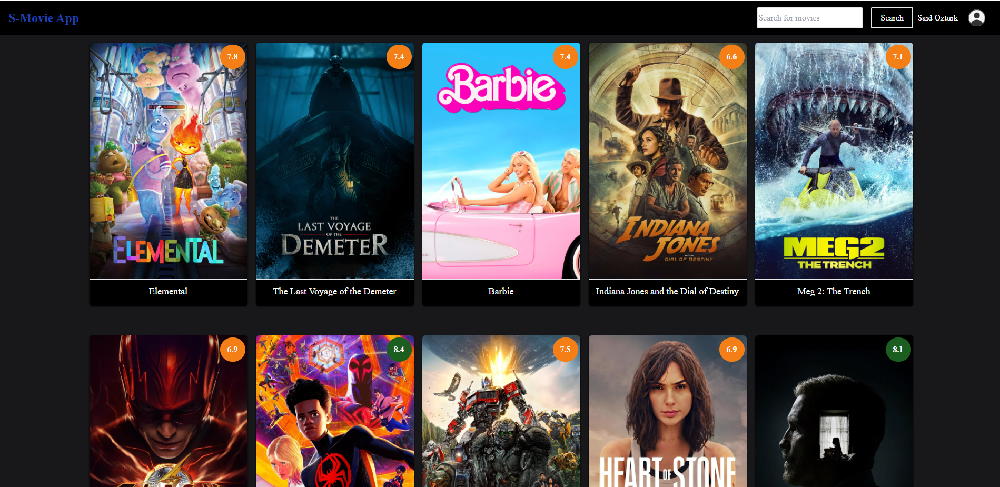

# React Movie App

## Outcome 

A web application built with React for discovering and exploring movies. This project integrates several technologies and features, including React Router DOM, Tailwind CSS, React Toastify, Firebase for authentication, Context API, Headless UI, Axios for data fetching, and private routes for registered users. Users can view movie details, search for movies, and enjoy a seamless movie discovery experience.

## Features

- Browse a wide range of movies.
- Search for movies by title.
- View detailed information about each movie.
- Authentication using Firebase (Email and Google account).
- Private routes - Only registered users can access certain pages.
- User-friendly notifications with React Toastify.
- Modern and responsive UI design with Tailwind CSS.
- Efficient data fetching with Axios.
- Seamless navigation with React Router DOM.
- Responsive and accessible components using Headless UI.
- Context API for state management.

## Demo

Check out the live demo of the React Movie App: https://my-movie-app-1a582.web.app/

